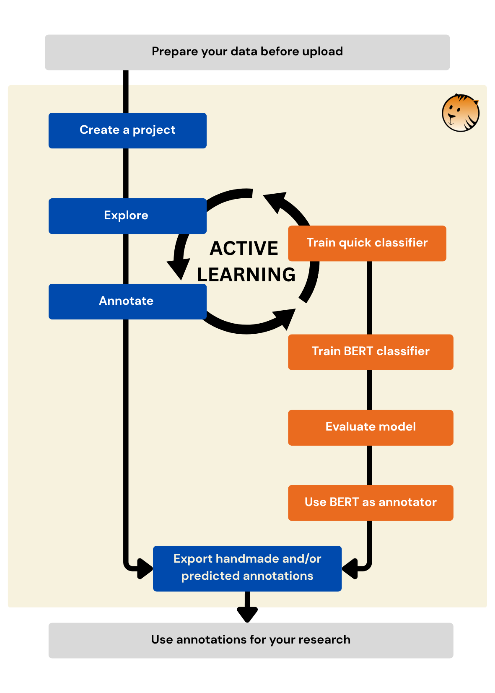
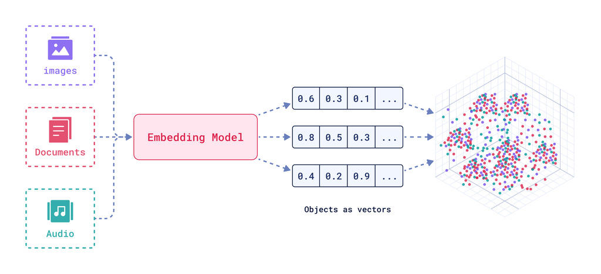

## Goals of the presentation

- Why ActiveTigger?
    - CSS & NLP
- Main features of ActiveTigger
    - Fundamental notions (embeddings, etc.)
    - How to get started
- Discussion
    - Specific uses
    - Evolution of our practices

## Origins of ActiveTigger

- For advanced/specific practices: code
- How to democratize stabilized uses?
    - Annotating large corpora with a set of labels
    - The need to collaborate on a project
    - Making training on tools easier
- Demonstrator in R (É. Ollion and J. Boelaert in 2023)
- Scaling up and building a community of practice
    - open source / reproducibility

## A tool rooted in research

The [CSS@IPP](https://www.css.cnrs.fr/) group at CREST

- [Le prix de la visibilité. Une analyse computationnelle des interactions en ligne avec des député·es français·es. Revue française de science politique, Claesson A., 2025](https://shs.cairn.info/revue-revue-francaise-de-science-politique-2025-3-page-IX)
-  [La part du genre. Genre et approche intersectionnelle dans les sciences sociales françaises au XXIe siècle, Boelaert J. et al, 2025.](https://shs.cairn.info/revue-actes-de-la-recherche-en-sciences-sociales-2025-3-4-page-126?lang=fr)

A broader community is forming

- Identifying press articles that talk about the environment (Jules Brion)
- ...

## Current status

(almost a) V1 + a community of users on the CREST dev instance

- [Page about the CSS group](css.cnrs.fr/active-tigger)
- [GitHub repository of the code](github.com/activetigger/activetigger)
- [Documentation](activetigger.com/documentation)
- [Discord server](https://discord.gg/sd2Em7rrW2)

For any information: emilien.schultz[at]ensae.fr

## Many contributions

- Scientific Committee
- Internal development
- Support by Ouestware (Paul Girard)
- Lots of feedback from users: Thank you!

## Showcase on a specific use case

**How is the consideration of reflections on gender evolving in the French social science literature?**

{fig-align="center"}

Data: Abstracts of social science articles published in French journals between 2000 and 2022.

## Why ActiveTigger?

*Everything can be done with a spreadsheet and code*

- Making interaction with the data easier (UX)
- Collaborative work
- Constraining the steps to guarantee progress
- Having active learning to annotate faster
- Access to GPU resources depending on the instance
- Processing at volume (lightweight encoders)

## When do people use ActiveTigger ?

- **Early stage** : explore the data
- **Mid stage** : stabilize a codebook (schemes/labels) and discuss edgecases
- **Late stage** : annotate a large corpus with a well-trained classifier

## Main steps

{fig-align="center"}

## General logic

**TL;DR: Put a "gender"/"not gender" label on a large volume of abstracts**

- Conceptual work to define the concepts
- Building a sample of annotated items
    - While maximizing diversity of elements and limiting time spent
- Training a classifier to predict
    - Improving this classifier enough for our goals
- Applying it to the whole corpus
- Downloading the results

## Other features

- Explore with Bertopic
- Select with the projection
- Use BERT predictions for active learning
- Compare annotations between users
- Experiment with generative AI

## In the beginning: data

A whole upstream effort: shaping the data into a table (not in ActiveTigger)

- ~30,000 articles, split at the sentence level = 50,000 rows
- Metadata present: journal, discipline and the proportion of men/women among co-authors
- A column of annotations used as a "gold standard"

## Central step: coding

Conceptual work: different conceptions of gender

- What are the categories?
- Experiment

*Choosing a broad conception: both gender relations, mentions of gendered aspects in social processes, etc.*

A step that is not really one: progressive stabilization

## Separating training and evaluation

The notion of a full dataset, a training set (train) and an evaluation set (validation / test)

{fig-align="center"}

Source: [Renesh Bedre — How to Split Data into Train and Test Sets in Python with sklearn](https://www.reneshbedre.com/blog/split-train-test-python.html)

## Moving to the demo

- Project already created
- Accounts available here on a demo instance: [https://hedgedoc.lab.groupe-genes.fr/ZRJKiToiSOebnHu5t5fFUA](https://hedgedoc.lab.groupe-genes.fr/ZRJKiToiSOebnHu5t5fFUA)

(you can create projects too, but if there are many of us, slowdowns are possible)

# Demo

## Getting started

- Send a mail for an account
    - Or create your own instance
- Get started on a project
- Come and chat on Discord

## The roadmap ?

- Improve GenAI integration
    - For experiment
    - To translate
    - ...
- Annotate images !
- Better architecture
    - Queue management
    - API with slurm job ?

**Always open to suggestions!**

## How to cite ActiveTigger

> Schultz, E., Boelaert, J., Morin, A., Bonutti D'Agostini, E., Claesson, A., Ollion, É., & Chatelain, A. (2026). ActiveTigger: An open source collaborative text annotation software for computational social sciences. In Proceedings of the 18th International Conference on Statistical Analysis of Textual Data (JADT 2026), Palermo, Italy, July 8–10, 2026.

# Appendix: notions

## Embeddings

Embeddings = vector representations of an entity with a model trained to preserve the semantic aspect.

{fig-align="center"}

Source [Joel Barnard — What is embedding?](https://www.ibm.com/think/topics/embedding) [Manoj Kumar — Explain vector embeddings to your mom](https://peerlist.io/manojsde/articles/explain-vector-embeddings-to-your-mom)

## Supervised learning

- Training data: examples annotated by humans
- Learning: a model (weights) progressively modified to improve prediction on this data
- Prediction: from a new input, predict the value
- Evaluation: check the quality of the prediction
    - Different metrics depending on the task
    - On data initially not used to train

## Active Learning

Rather than annotating at random, select certain items

- Start: train a model on a small number of annotations
- Identify the most uncertain items
- Prioritize these items
- Retrain the model & iterate

Why is this useful?

- Less labeling: reduce human work
- Higher-quality datasets: limit redundant information

## BERT classifier

A particular architecture of pre-trained models (transformers) of the encoder type, of "reasonable" size.

Source: [Jay Alammar — The Illustrated BERT, ELMo, and co. (How NLP Cracked Transfer Learning)](https://jalammar.github.io/illustrated-bert/)

## Quick and BERT models

Different types of models

- The number of weights: quick = hundreds of parameters; BERT = hundreds of millions
- Pre-training: quick = trained only on the data; BERT = pre-trained on very large corpora
- Training time: <2 min for the quick ones and up to several tens of minutes for the larger BERT models