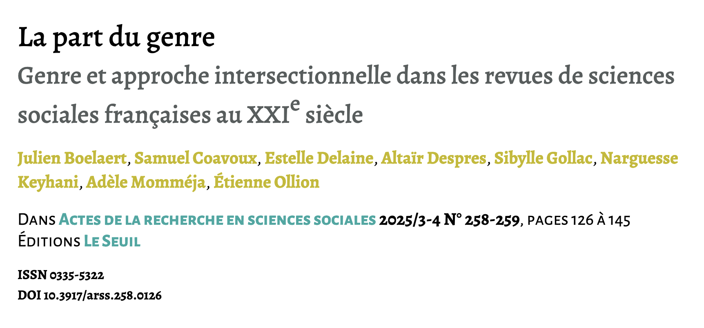
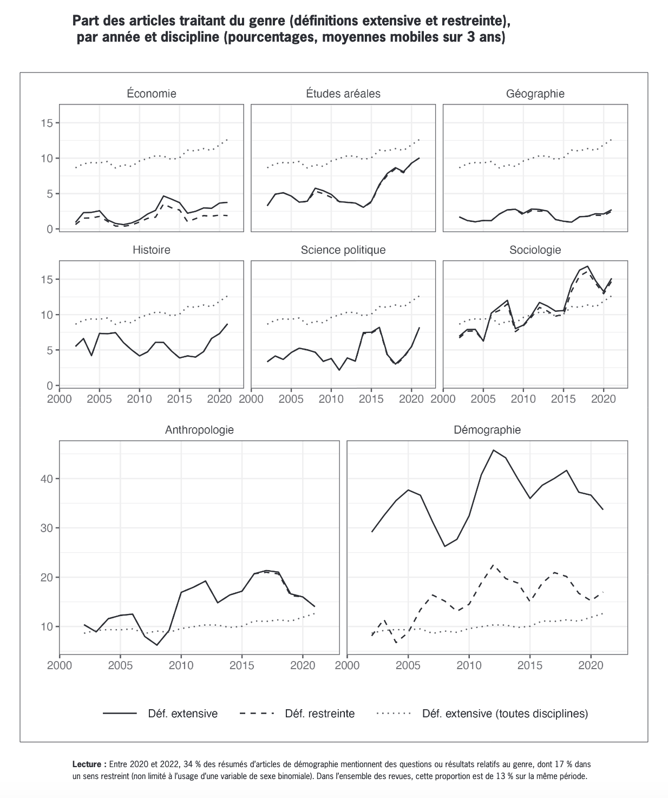
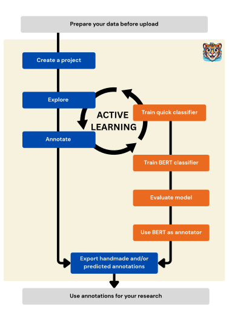

## Objectifs de la présentation

- Pourquoi ActiveTigger ? 
    - CSS & NLP
- Principales fonctionnalités
    - Comment se lancer ?
- Discussions
    - Concepts
    - Usages

**Pas un cours théorique**

## Origines

- Programmer = flexibilité
- Ouvrir les usages stabilisés ?
    - Annoter des grands corpus avec un ensemble de labels
    - Besoin de collaborer sur un projet
    - Faciliter la formation aux outils
- Un démonstrateur en R développé par É. Ollion et J.Boelaert en 2023
- Mettre à l'échelle et constituer une communauté de pratique
    - open source / reproductibilité

## Un outil ancré dans la recherche

Groupe [CSS@IPP](https://www.css.cnrs.fr/) au CREST (Groupe ENSAE-ENSAI / CNRS / Polytechnique)

-  *La part du genre. Genre et approche intersectionnelle dans les sciences sociales françaises au XXIe siècle, Boelaert J. et al, 2025.*
- *Le prix de la visibilité. Une analyse computationnelle des interactions en ligne avec des député·es français·es. Revue française de science politique, Claesson A., 2025*

Une communauté d'utilisateurs.rices en formation

## Quelle IA dans ActiveTigger ?

- Du machine learning 'classique'
- Des modèles 'légers' BERT
- Expérimentations ponctuelles avec du génératif

Enjeu : garder la main sur l'annotation, l'évaluation et l'interprétation

## Situation actuelle

Presque une V1 + communauté d'utilisateurs instance dev. du CREST

- [Site CSS.CNRS.fr](css.cnrs.fr/active-tigger)
- [Documentation](activetigger.com/documentation)
- [Dépot Github du code](github.com/activetigger/activetigger)
- [Serveur Discord](https://discord.gg/sd2Em7rrW2)

Pour toute info : emilien.schultz[at]ensae.fr

## Des contributeurs multiples

- Comité Scientifique
- Développement interne
- Soutien par Ouestware (Paul Girard)
- Beaucoup de retours des utilisateurs : Merci !

## Introduction pratique par une démo

**Comment évolue la prise en compte des réflexion sur le genre dans la littérature en sciences sociales françaises ?** 

{fig-align="center"}

*Données: Abstract des articles de sciences sociales publiés dans des revues françaises*

## Annoter, généraliser puis analyser

{fig-align="center"}

## Logique générale

En pratique : des étiquettes sur des textes

- Travail conceptuel pour définir les concepts
- Construire un échantillon d'éléments annotés
    - En maximisant la diversité et en limitant le temps passé
- Entrainer un classifieur **texte -> label**
- L'appliquer à l'ensemble du corpus
- Télécharger les résultats et le classifieur pour la reproductibilité

##

{fig-align="center"}

## Alors pourquoi Active Tigger ?

- Facilier l'interaction avec les données
- Contraindre les étapes pour garantir la progression
- Avoir de l'active learning pour annoter plus vite
- Travail en collaboration
- Accès à des ressources GPU en fonction de l'instance
- Traitement en volume (encodeurs assez légers)

## Entrée : des données tabulaires

Travail en amont : mettre en forme les données

- ~30,000 articles, découpées au niveau de la phrase = 50,000 lignes
- Chaque phrase fait en moyenne 170 caractères
- Métadonnées présentes: revue, discipline et la proportion d'hommes/femmes dans les co-auteur.ices

## Étape centrale & conceptuel : le codage

- Différentes conception du genre
- Quelles sont les catégories retenues ?
- Expérimenter
    
*Choix d'une conception large : à la fois rapports de genre, mention des aspects genrés dans les processus sociaux, etc.*

Une étape qui n'en est pas une : stabilisation progressive

## Division du jeux de données en sous-ensembles

Notion de jeu de données complet, d'entrainement (train) et d'évaluation (validation / test)

{fig-align="center"}

Source : [Renesh Bedre — How to Split Data into Train and Test Sets in Python with sklearn](https://www.reneshbedre.com/blog/split-train-test-python.html)

## Passage à la démo

- Projet déjà créé
- Comptes accessibles ici sur une instance démo : https://hedgedoc.lab.groupe-genes.fr/LFtZt3mcQO-MzKdcb7nY4Q

(vous pouvez créer des projets aussi, mais si on est nombreux ralentissements possibles)

# Démo

## Aller plus loin : d'autres fonctionnalités

- Explorer avec Bertopic
- Sélectionner avec une projection
- Utiliser les prédictions des BERT pour l'active learning
- Comparer les annotations entre utilisateurs
- Expérimenter avec le génératif
- Client Python pour gérer l'instance

## Se lancer

- Se lancer dans un projet
- Venir discuter sur le discord
- Réfléchir à la prochaine étape
    - Les modules à développer
- Ouvrir de nouvelles instances

# Quelques notions

## Qu'est ce qu'un embedding?

Les embeddings (ou plongement) sont des représentations vectorielles d'une entité qui encode son information pour permettre ensuite des traitements de machine learning

Source [Joel Barnard — What is embedding?](https://www.ibm.com/think/topics/embedding)

Source: [Manoj Kumar — Explain vector embeddings to your mom](https://peerlist.io/manojsde/articles/explain-vector-embeddings-to-your-mom)

## Logique générale de l'apprentissage supervisé

Des annotations initiales faites par des humains

- Données d'entraînement : on fournit à la machine des milliers d'exemples avec la "bonne réponse"
- Apprentissage : un modèle (poids) est progressivement modifié pour améliorer la prédiction sur ces données initiales
    - Différents types de modèles : ML, DL, ...
- Prédiction : le modèle peut prédire sur des données, notamment nouvelles
- Évaluation : les prédictions sont comparables aux annotations initiales
    - Différentes métriques suivant la tâche
    - Sur des données initialement non utilisées pour entrainer

## Qu'est-ce que l'Active Learning ?

Plutôt que d'annoter au hasard, des règles de sélection des éléments 

Comment ça marche ?

- Départ : entrainer un modèle sur un petit nombre d'annotation
- Identification des éléments les plus incertains
- Prioriser ces éléments
- Réentrainer le modèle & itérer

Pourquoi c'est utile ?

- Moins d'étiquetage : réduire le travail humain
- Datasets de meilleur qualité : limiter la redondance de l'information

## Qu'est ce qu'un classifier BERT ?

Source: [Jay Alammar — The Illustrated BERT, ELMo, and co. (How NLP Cracked Transfer Learning)](https://jalammar.github.io/illustrated-bert/)

## Que sont les features ? 

Dans Active Tigger, on peut donner de nombreuses représentations numériques aux textes: 

- Embeddings : générés avec des modèles pré-entrainés
- Fasttext : généré avec des XXX
- DFM : représentation par comptage de mots dans les documents
- Regex : valeur booleenne, l'expression reguliere a-t-elle été trouvée dans le texte?
- métadonnées à importées

## Quelle est la différence entre les quick et BERT modèles

Dans les deux cas, ces modèles sont utilisés comme **classifieurs**. On les entraîne et évalue de la même manière. Les différences majeurs: 

- Le temps d'entraînement : <2 min pour les quicks et jusqu'à plusieurs dizaines de minutes pour les plus gros modèles BERT
- Le nombre de poids : Les modèles quick contiennent plusieurs centaines de paramètres tout au plus, quand les modèles BERT peuvent en contenir plusieurs centaines de millions
    - Cette différence vient du fait que les modèles quick s'appuient sur des features qui ne sont pas mises à jour pendant l'entraînement alors que le modèle BERT vient altérer l'espace de plongement pour atteindre de meilleures performances (supposément).x

## Évaluer une classification

Au coeur : données de test - ground truth / gold standard

Des métriques classiques

- Accuracy : proportion générale de bonne classification
- Precision :  proportion des éléments que le modèle a classés comme positifs qui sont réellement positifs
- Recall : proportion des éléments réellement positifs que le modèle a correctement identifiés comme positifs
- F1-score : moyenne harmonique de precision et recall